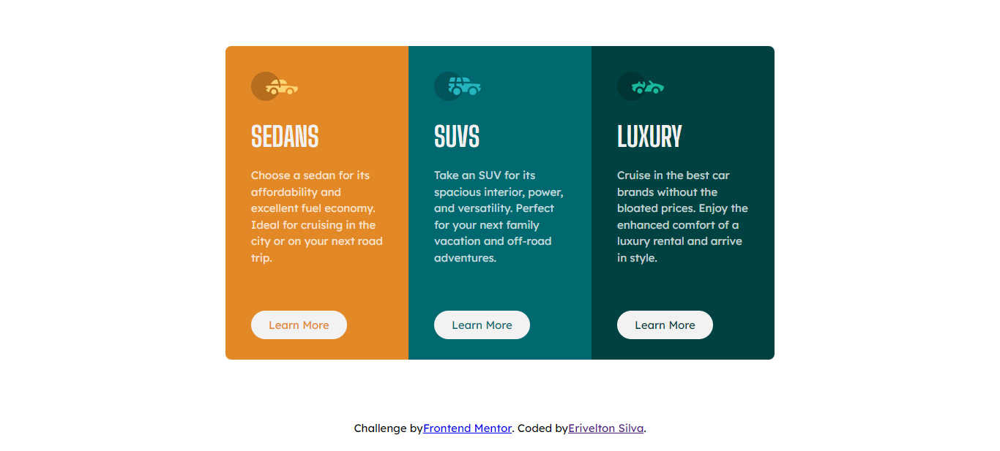

# Frontend Mentor - 3-column preview card component solution

This is a solution to the [3-column preview card component challenge on Frontend Mentor](https://www.frontendmentor.io/challenges/3column-preview-card-component-pH92eAR2-). Frontend Mentor challenges help you improve your coding skills by building realistic projects.

## Table of contents

-   [Overview](#overview)
    -   [The challenge](#the-challenge)
    -   [Screenshot](#screenshot)
    -   [Links](#links)
-   [My process](#my-process)
    -   [Built with](#built-with)
-   [Author](#author)

## Overview

### The challenge

Users should be able to:

-   View the optimal layout depending on their device's screen size
-   See hover states for interactive elements

### Screenshot

### Links

-   Solution URL: [https://www.frontendmentor.io/solutions/3-column-preview-card-component-main-usando-o-vuejs-VaHUiyFt6X](https://www.frontendmentor.io/solutions/3-column-preview-card-component-main-usando-o-vuejs-VaHUiyFt6X)
-   Live Site URL: [https://3-column-preview-card-component-main-eight-zeta.vercel.app/](https://3-column-preview-card-component-main-eight-zeta.vercel.app/)

## My process

### Built with

-   Semantic HTML5 markup
-   CSS custom properties
-   Flexbox
-   CSS Grid
-   BEM
-   ITCSS
-   SASS
-   [Vue.js](https://vuejs.org/) - JS Framework

## Author

-   Frontend Mentor - [@eriveltondasilva](https://www.frontendmentor.io/profile/eriveltondasilva)
-   Instagram - [@erivelton.dsilva](https://www.instagram.com/erivelton.dsilva/)
-   Twitter - [@EriveltonDSilva](https://twitter.com/EriveltonDSilva)
